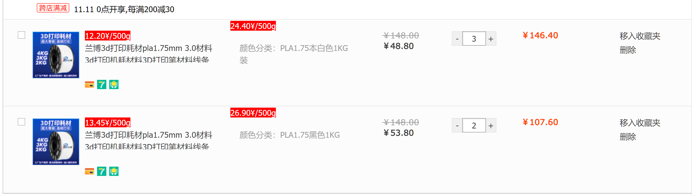

# userscript.js

snomiao's userscripts, sync to [snomiao - Greasy Fork](https://greasyfork.org/zh-CN/users/31387-snomiao)

## pricesof500g.userscript.js

提供购物车的相对重量（或容积）的价格标签并自动排序，常用于挑选相对重量（或容积）价格比最高的商品。
使用场景包括但不限于例如购买廉价耗材、食品、按数据容积购买数据存储设备等。

| 场景         | 例图                        |
| ------------ | --------------------------- |
| 淘宝购物车   |   |
| 京东搜索页面 |  |

## See me at:

Greasy Fork: [snomiao - Greasy Fork](https://greasyfork.org/zh-CN/users/31387-snomiao) (Sync with this repo)

Github: [snomiao/userscript.js: sync to greasyfork.com](https://github.com/snomiao/userscript.js#readme) (Source)

## Sync By github

from:
- https://github.com/snomiao/userscript.js

to:
- [Import scripts - greasyfork]( https://greasyfork.org/en/import )
- [New Script | OpenUserJS]( https://openuserjs.org/user/add/scripts )

## ref

---

## markdown style

